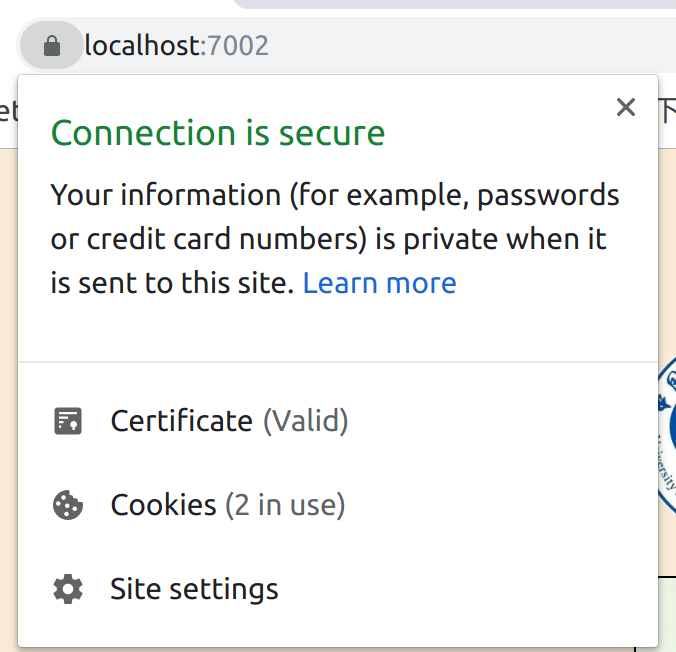

# websecurity
## environment
- docker
- docker-compose

## usage
### build
> workdir=$(your workspace)  
> user@ubuntu:$ workdir/$git clone git@github.com:qzwsq/websecurity.git  
> user@ubuntu:$ cd websecurity  
> user@ubuntu:$ workdir/$sudo docker-compose up -d  

view  
localhost:7001/index.php or localhost:7002/index.php 

### exec container 
> user@ubuntu:$ sudo docker exec -it websecurity_webapp_1 bash

### trace php server log
> root@603bf93113ba:/home/workspace# tail -f /var/log/apache2/error.log 

### default account
username: admin password: 123456  

### https  
> \# generated root CA location: $workdir/USTCWebsecurity/myCA.crt  
> \# import myCA.crt in chrome  
> \# [visit website](https://localhost:7002/index.php)  

